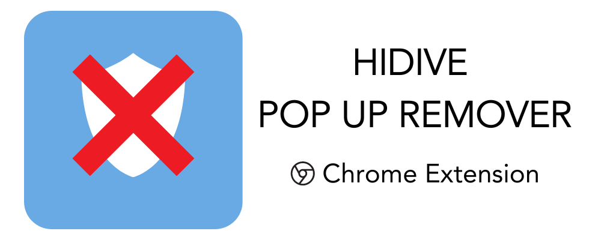

# HIDIVE Cookies Popup Remover

<h1 style="text-align: center;">
    
</h1>

## Description

When loading up HIDIVE, a small popup shows up for the cookies, which is usually fine, but **doesn't disappear when the video
is playing!**

To fix this, I have created a Chrome extension to remove the pop-up when a video is playing.

## Local Installation

Clone this repo to gain access to the original project files. 

Then, access your extension page in your browser and enable developer tools.

Some supporting browser extension page links are as follows:

- Chrome: [chrome://extensions/](chrome://extensions/)
- Edge: [edge://extensions/](edge://extensions/)

Find the "Load Unpacked" button and select the `/extension` folder in this project.

This should now have added the extension to your browser for use! 