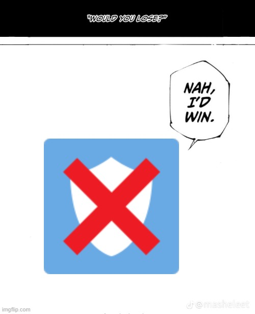

# HIDIVE Cookies Popup Remover

<h1 style="text-align: center;">
    
</h1>

## Description

When loading up HIDIVE, a small popup shows up for the cookies, which is usually fine, but **doesn't disappear when the video
is playing!**

To fix this, I have created a Chrome extension to remove the pop-up when a video is playing.

This extension works on **any Chromium browser** so feel free to use it on other chromium supported browers!

## Local Installation

### Clone the Repo 

Click the green "Code" button on this page and download, either using GIT or simply downloading the ZIP!

If you downloaded the zip, please extract it to a safe place on your system.

### Activating Developer Mode

You will need to access your extension page in your browser and enable developer tools.

Some supporting browser extension page links are as follows:

- Chrome: [chrome://extensions/](chrome://extensions/)
- Edge: [edge://extensions/](edge://extensions/)

Find the "developer tools" in your extension page (there should be a toggle for it somewhere)

### Installing the package

A newly loaded "Load unpacked" button should've appeared on the top of your page for extensions now!

Select this and then select the `extension` folder in this project.

This should now have added the extension to your browser for use! 

You can toggle this extension by simply activating it or deactivating it in your extension browser.

### More Help!

If you need more help on this process, please visit https://developer.chrome.com/docs/extensions/get-started/tutorial/hello-world#load-unpacked

The site above should help with loading a package and finding the relevant page.